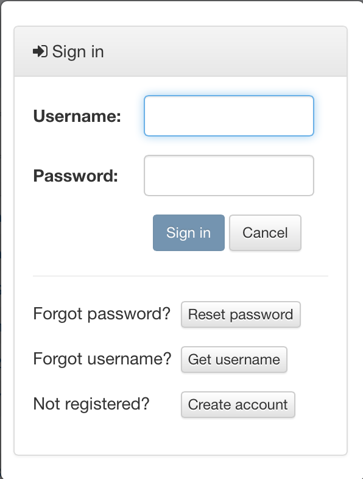
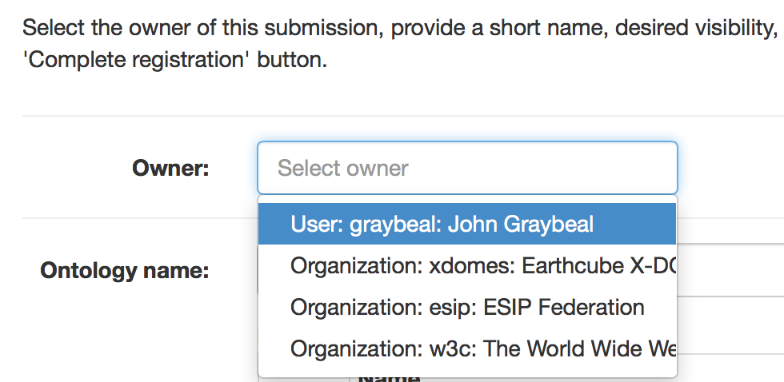
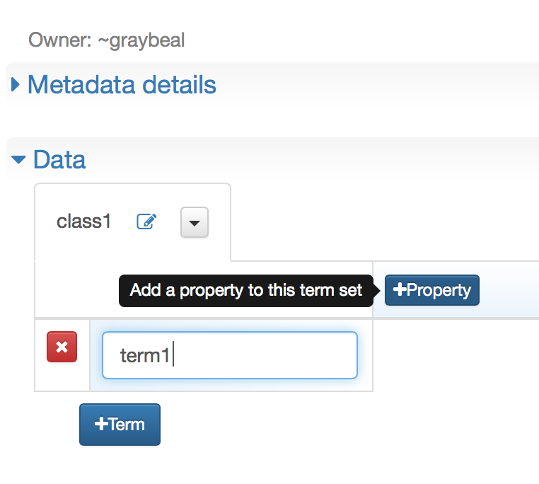

!!! tip
    _Page Status_: **In Progress**
    
!!! tip
    The screen shots in this presentation are made using the ESIP COR service.   
    Most features are also available in a similar form in the MMI ORR site; see the [MMI ORR help pages](https://marinemetadata.org/mmiorrusrman/mmiorrgetstarted) for details.
    

## Using existing semantic data

1\. Open the desired ORR site in your browser

MMI ORR site: http://mmisw.org/orr/   
ESIP COR site: http://cor.esipfed.org

2\. Browse list of registered ontologies

Even if not signed in, you will see all registered ontologies in the main ORR browse page (*).

The left-hand side tree widget allows you to select the entries in the ontology table according to the owner (the authority owning the ontology), submitter (if you are signed in),  status (testing, unstable, draft, stable, deprecated, or archaic), resource type (selected by the ontology submitter), and type of hosting (fully-hosted, or re-hosted). 

You can control which columns are visible using the 'hamburger' selector on the right. You can also click any column header in the table to have the list sorted by that column. 
Click the header again to reverse the order, or hold down the mouse button to see a delete option if available. (The URI column can not be submitted.)

(*) Except those marked as Status="testing" or Visibility="owner" that you have not submitted yourself.  These ontologies are only visible to the submitter.

3\. Explore contents of an ontology

Click an entry in the browse table to explore a particular ontology.

The main operations available when viewing an ontology are:

*	Copy the ontologies URI to the clipboard, using the button with the clipboard icon.

*   View or download the ontology in a particular format. The viewing options are "RDF/XML" "N3", "Turtle", and "N Triples". Ontologies can also be downloaded in JSON-LD or RDF/JSON formats. Just choose the desired format in the list.

*   View list of versions of the ontology: click the "Versions" button.

*	Viewing the metadata details in the various categories shown in the tabs.

If you are an owner of the original ontology, you have additional options:

*	Change the Status of the ontology.

*	Change the Visibility of the ontology in the main browse page (either owner-only, or publicly visible). Note all ontologies, even owner-only, can still be viewed by anyone having the URI. 

*   Create a new version (if you are the submitter of the original ontology): Click the "Edit new version" button at the far left to start creating a new version of the ontology. This also allows editing the ontology's metadata.

4\. Search for term

In the main ORR page or any ontology page, click the "Term Search" link. You will see a page that looks like the following:


The given string will be searched exactly as typed, ignoring case, across all property values in  the latest version of each registered ontology. You can use "OR" to separate alternate strings for the search.

5\. Perform a SPARQL query

Also in the main ORR page or any ontology page, click the "SPARQL query" link. You will see a page that looks like the following:


This page provides an interface that let you enter example or customized SPARQL queries to run against the latest version of all the registered ontologies in the repository. It also provides the location of the SPARQL interface, allowing it to be accessed programmatically.

## Providing semantic content 

### Adding an ontology

To create or upload and register an ontology:

1\. Open the desired ORR site in your browser

MMI ORR site: http://mmisw.org/orr/   
ESIP COR site: http://cor.esipfed.org

2\. Create an account

If you do not have an account, click the "Create account" link in the main ORR page, and fill out the resulting form: 


The telephone number is only used to assist in the operation of the repository.

3\. Sign in

If you are not yet signed in, click the "Sign in" link in the main ORR page, and enter your account information:



4\. Upload ontology file or create vocabulary

4\.1 Upload existing ontology file and associated metadata

If you already have an ontology file, click the "Upload ontology" button on the main 
page to submit it the ORR. 
(Please see the ["Registering your existing ontology"](http://mmisw.org/orrdoc/upload/) section] for more details about ontology upload features.)

A wizard dialog will appear. In the wizard, select the local file and load it to the workspace. 


In the following dialog, you will either select or enter the URI used as the ontology URI. If the system can detect an ontology URI candidate within the ontology, it will provide it as a selection item, as shown in this dialog. Click on the select button to choose any URI that you want to use as the ontology URI.


Once the Next button is selected, any metadata detected in the imported ontology is shown in the next dialog.


Next you will be asked to choose the type of registration (fully-hosted or re-hosted).  Details about these options are provided in the ["Registering your existing ontology"](http://mmisw.org/orrdoc/upload/) section]. 


Finally, you will complete the metadata details necessary for registering your ontology. These include the individual or organizational owner (shown below), a short name for the final URI for the ontology, the visibility of the ontology in the browse page, and the status of the ontology.  




!!! tip If you are testing the process or your ontology, please choose "testing" as the status, so that your ontology is not visible to all the other users.

When you complete this step, ORR should tell you the ontology is successfully registered.


4\.2 Upload vocabulary file and associated metadata

If you have your vocabulary in a text file, for example, then you may follow these steps.

Once signed in, click "Upload vocabulary" button in the main ORR page. [Add screenshots.]

Complete the metadata in the "Metadata details" section. 

``` 
Needs Updating   
In the "Contents" section, select the down arrow in the first cell of the table choose "Import".  
Choose comma, semi-colon, tab, or vertical bar delimited file. Paste contents of vocabulary file.  
Choose "import". 
```

You can then review and register the ontology. Please see the 
["Creating a Vocabulary"](http://mmisw.org/orrdoc/vocab/new/) 
section for more details.

4\.3 Create vocabulary contents and associated metadata

Once signed in, click the "Create vocabulary" button in the main ORR page.


To register your vocabulary, you need to create metadata to describe the ontology. Required metadata is shown with a red asterisk.


If you aren't sure what a particular metadata field means, hover over the field to get help.


You can start by selecting a local class name -- this is a required field


Then you can fill in the vocabulary contents, that is, the list of terms and associated properties, or information, for each term. Click on +Term to add a new term, and +Property to add a new piece of information that needs to be filled in for each term.



5\. Register resulting vocabulary

When you have filled out the ontology with at least one term and one property, it is ready to be registered. When you are done with the contents and metadata for your vocabulary, click on the Register button to create the ontology. 

You may get an error message indicating that the ontology cannot be registered according to the provided information, or without providing some key information. Resolve the issue in order to complete the registration.
 

