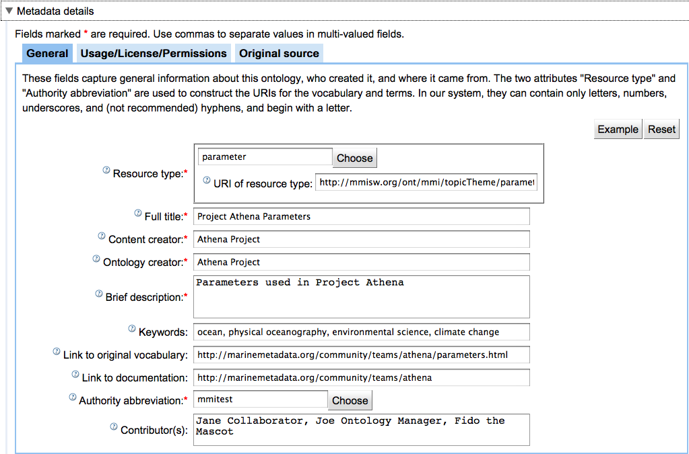

!!! warning
    Contents being migrated/updated from 
    [mmiorrusrman/mmiorrgetstarted](https://marinemetadata.org/mmiorrusrman/mmiorrgetstarted)

## As a semantic data provider 

To create or upload and register an ontology:

1\. Open the ORR site in your browser: [http://mmisw.org/orr/](http://mmisw.org/orr/)

2\. Create an account

Click the "Create account" link

3\. Sign in

If you are not yet signed in, click the "Sign in" link in the main ORR page:

4\. Upload ontology file or create vocabulary

4.1 Upload existing ontology file and associated metadata

If you already have an ontology file, click the "Upload ontology" button on the main 
page to submit it the ORR. 
(Please see[the "Registering your ontology" section](/mmiorrusrman/mmiorrref/mmiorruploadexisting) 
more details.) [Add screenshots]

A wizard dialog will appear.  In the wizard, select the local file and load it to the workspace. 
Choose the type of registration (fully-hosted, re-hosted, or indexed-only).  
Specify an authority abbreviation and a short name for the final URI for the ontology.  
You may choose "check" to check for the availability of the URI.

Complete the metadata details necessary for registering your ontology:

Note: If you are testing the process or your ontology, please choose either "testing" or "mmitest" 
for the "Authority abbreviation".

Choose "Finish".

4.2 Upload vocabulary file and associated metadata

If you have your vocabulary in a text file, for example, then you may follow these steps.

Once signed in, click "Create vocabulary" button in the main ORR page. [Add screenshots.]

Complete the metadata in the "Metadata details" section. 
(Note: If you are testing the process or your ontology, please choose either "testing" or 
"mmitest" for the "Authority abbreviation".)

In the "Contents" section, select the down arrow in the first cell of the table choose "Import".  
Choose comma, semi-colon, tab, or vertical bar delimited file. Paste contents of vocabulary file.  
Choose "import". 

You can then review and register the ontology. Please see the 
["Creating a Vocabulary"](/mmiorrusrman/mmiorrnewusracct/mmiorrsignin/mmiorrnewvocab) 
section for more details.

4.3 Create vocabulary contents and associated metadata

Once signed in, click the "Create vocabulary" button in the main ORR page.

You can start by selecting a class name (required field) and filling in the vocabulary contents, that is, 
the list of terms and associated information (e.g., description):

Type ENTER in a cell to edit the contents of the cell. Type ENTER again to complete the editing of the cell.  
Click the little triangle icons to open a pop-up menu with options corresponding to the associated section.

To register your vocabulary, you need to provide metadata information.

Expand the "metadata details" section by clicking the header:

Note: If you are testing the process or your ontology, please choose either "testing" or "mmitest" 
for the "Authority abbreviation".

Please see the ["Creating a Vocabulary"](/mmiorrusrman/mmiorrnewusracct/mmiorrsignin/mmiorrnewvocab) 
section for more details.

5\. Register resulting vocabulary

Once you are done with the contents and metadata for your vocabulary, click the "Review and Register" button

You should get a message indicating that the ontology is ready to be registered, so you can click the 
"Register" button to complete the registration.

Alternatively, you may get an error message indicating that the ontology cannot be registered according 
to the provided information. A common error is related with a namespace conflict with an already 
existing ontology. If that is the case, adjust the resource type and/or the authority abbreviation 
fields in the metadata section to avoid the conflict. (These two fields are used to compose the final 
ontology URI; see [here](http://marinemetadata.org/apguides/ontprovidersguide/ontguideconstructinguris).)

## As a semantic data user

1\. Open the ORR site in your browser

ORR site: http://mmisw.org/orr/

2\. Browse list of registered ontologies

Even if not signed in, you will see all registered ontologies in the main ORR browse page (*).

The left-hand side tree widget allows you to select the entries in the ontology table according 
to submitter (if signed in), authority abbreviation, and type of ontology. 
You can also click a column header in the table to have the list sorted by that column. 
Click the header again to reverse the order.

(*) Except the ones marked as "for testing purposes" that you have not submitted yourself. 
Any ontology whose authority is either "testing" or "mmitest" is considered "for testing purposes" 
and is only visible to the submitter.

3\. Explore contents of an ontology

Click an entry in the browse table to explore a particular ontology.

The main operations available when viewing an ontology are:

*   View the ontology in a particular format. Currently, the options are: "RDF/XML" and "N3". 
Just click the link of the desired format.

*   You can also explore the ontology by using the external "Ontology Browser" tool.

*   Create a new version (if you are the submitter of the original ontology): Click the 
"Edit new version" button to start editing the ontology.

*   View list of versions of the ontology: click the "Versions" button.

4\. Search for term

In the main ORR page, click the "Search" button. You will see a page that looks like the following example:

The given string will be searched as given (ignoring case) in all property values in all the latest 
version of the registered ontologies. You can use "OR" to separate alternative string for the search.
