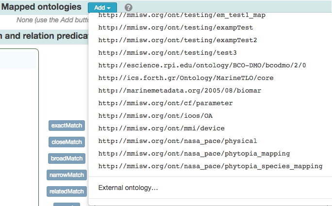

!!! tip
    _Page Status_: **Under revision**. 

As described in the [Semantic Web Basics section](../semweb.md#direct-triple-table), the ORR includes a mechanism
that allows to directly capture a set of _subject-predicate-object triples_, in a so-called _mapping ontology_.

## Steps for Creating a Mapping Ontology

1\. Sign in to ORR

2\. Click the "Create mapping" button.

3\. Indicate owner, IRI, visibility, and status for the new ontology.

4\. Complete the metadata details for your new mapping ontology.

There are 3 main subsections under the Data section

- Mapped ontologies
- Term and relation predicate selection
- Defined term mappings

Hover you mouse on the various `(?)` icons for guidance.

5\. Click on "Add" button in the 'Mapped ontologies' subsection to include the ontologies between which
you would like to map. 
You can select from the list of registered ontologies at the ORR instance, or enter the URL of
an external ontologies.

Each loaded ontology will be assigned a number to identify it in the subsection below.

6\. Select the terms to be mapped and the corresponding relationship predicates.
Once one or more ontologies are loaded, use the numbered buttons to select the corresponding ontologies to
load on each side of the 'Term and relation predicate selection' subsection.
The left- and right-hand sides here will respectively contain potential
'subjects' and 'objects' for the needed mappings.
All terms from the selected ontologies will be displayed.
To facilitate the term selection you can use the filter on each side to narrow down the list of displayed elements.
Once subjects and objects that should be mapped together according to a specific predicate are selected,
click the respective button in the middle of this section.
Once clicked, the corresponding set of subject–predicate–object triples will be added to the
table in the 'Defined term mappings' subsection.

7\. Review and complete the desired mappings.
To facilitate inspection, in the 'Defined term mappings' subsection 
you can filter by subject, predicate, or object. You can also remove any unnecessary mappings.
For this, use the checkboxes on the left and then click the 'Remove selected' button.

!!! note
    The filtering in the 'Defined term mappings' table does not affect the triple selection
    (which might get partially or totally hidden depending on the current filtering).

When done with the mappings, click the "Register" button at the top of the page to proceed with registration.

## Additional References

[Guide to the Mapping Process](https://marinemetadata.org/node/4944)
