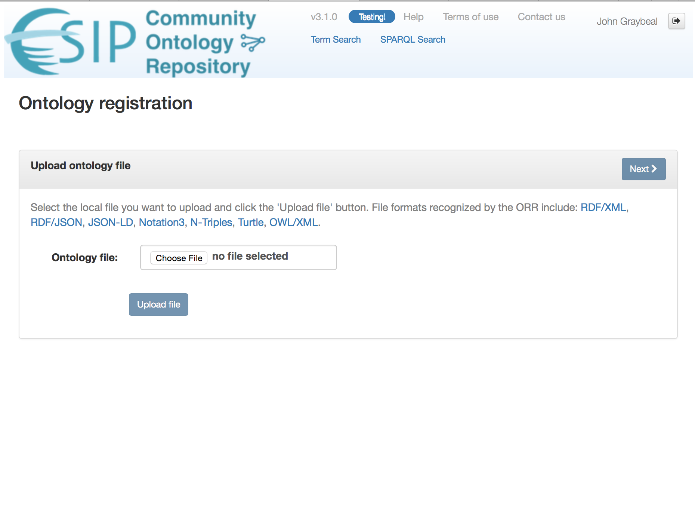

!!! tip
    _Page Status_: **In Progress** 

## Before you start: Things to know

You will need some basic knowledge before you try to upload your ontology. This section outlines that knowledge.

### What formats are supported for registering ontology files?

The following standard formats are supported:

*   [RDF/XML](https://www.w3.org/TR/REC-rdf-syntax/)
*   [RDF/JSON](https://www.w3.org/TR/rdf-json/)
*   [JSON-LD](https://www.w3.org/TR/json-ld/)
*   [Notation3](https://www.w3.org/TeamSubmission/n3/)
*   [N-TRIPLE](https://www.w3.org/TR/n-triples/)
*   [TURTLE](https://www.w3.org/TeamSubmission/turtle/)
*   [OWL/XML](https://www.w3.org/TR/owl-xml-serialization/)

### What options are available for hosting ontologies?

ORR offers two options to register an existing ontology: _fully-hosted_ mode and _re-hosted_ mode.
These strongly affect the way your ontology and its terms are treated by the ORR.

#### Fully-hosted ontology

In this case, ORR will assign an IRI base, corresponding to the URL where the particular ORR
instance is installed, to your ontology and its associated 
terms sharing the same namespace. 
For example, this base URL is `http://cor.esipfed.org/ont` in the case of the COR instance.
More specifically, the original base IRI of the ontology will be 
overwritten with one assigned by ORR during the registration process.
  
*   **URI Resolvability.** The given ORR based IRIs given to your ontology (and to all the terms in the 
associated namespace) will be self-resolvable, i.e., you will be able to directly enter them into your 
browser or semantic web tool to get it resolved to the contents of your ontology or term. 
The indirect mechanisms described below are also provided in this case.
  
*   **Versioning**. Full support for versioning including scheme for "versioned" URIs for the ontology and its terms, for example, http://mmisw.org/ont/mmi/20090818T043834/device. Also, support for the "unversioned" request to get the latest version of your ontology, eg., http://mmisw.org/ont/mmi/device  

*   **Ontology owner responsibilities.** The owner will submit the ontology (or have MMI submit it on the owner's behalf), provide the requested metadata, and review the ontology once it has been submitted to the ORR. The owner will also provide updates directly to the repository (or ask MMI to do it for you).  

*   **MMI responsibilities.** If the owner requests it, MMI will submit the ontology to the ORR on the owner's behalf.  MMI will contact the owner for the ontology's metadata and to review the ontology once it has been submitted to the ORR.  At the owner's request, MMI may update the ontology.

#### Re-hosted ontology

The general registration process (including metadata editing) is similar to the fully hosted option, but 
the original xml:base namespace associated with your ontology will not be changed at all.  

*   **IRI Resolvability.** 
The IRIs of your ontology and associated terms can be resolved indirectly by 
the MMI Ontology and Term URI Resolver via the "uri" parameter, eg., 
`http://mmisw.org/ont?uri=http://example.com/my/ontologyuri`. 
You can also indirectly access the ontology and terms via searches against ORR. 
NOTE: Your ontology could also be resolved by its own IRI if that is supported by its 
original web server, but that's beyond ORR's scope.  

*   **Versioning.** 
Support for basic versioning as in the full hosted option but with the 
following limitations: 
The IRI of your ontology is, in general, completely opaque and, in particular, for purposes of versioning. 
This means that (continuing with the example above) `http://example.com/my/ontologyuri` will be the only 
IRI associated with your ontology (`http://mmisw.org/ont?uri=http://example.com/my/ontologyuri` will always 
respond with the latest registered version of your ontology). 
To get a particular version, the "version" parameter should be used, e,g., 
`http://mmisw.org/ont?uri=http://example.com/my/ontologyuri&version=20090922`  

*   **Ontology owner responsibilities.** 
The owner will submit the ontology (or have MMI submit it on the owner's behalf), provide the requested 
metadata, and review the ontology once it has been submitted to the ORR. The owner will also provide 
updates directly to the repository (or ask MMI to do it for you).  

*   **MMI responsibilities.**  
If the owner requests it, MMI will submit the ontology to the ORR on the owner's behalf.  
MMI will contact the owner for the ontology's metadata and to review the ontology once it has 
been submitted to the ORR.  At the owner's request, MMI may update the ontology.

The following section provides instructions on how to submit your existing ontology to the ORR.

## Uploading your ontology

To upload and register an ontology, you must be logged in as described above,
and have an ontology file you have created in one of the above formats.

Click the "Upload ontology" button on the main page to begin the submission process.

A wizard dialog appears. In the wizard, select the local file and load it to the workspace. 

In the following dialog, you will either select or enter the URI used as the ontology identifier (the IRI). 
If the system detects an ontology IRI candidate within the ontology, the IRI will be shown as a selection item, as shown in this dialog. Click on the select button to choose any IRI that you want to use as the ontology URI.

Once the `Next` button is selected, any metadata detected in the imported ontology is shown in the next dialog.

Next you will be asked to choose the type of registration (fully-hosted or re-hosted).  Details about these options are provided in the section above. 

Finally, you will complete the metadata details necessary for registering your ontology. 
These include the individual or organizational owner (shown at right), 
a short name used as part of the final IRI for the ontology, 
the visibility of the ontology in the browse page, 
and the status of the ontology.  

!!! tip 
    If you are testing the process or your ontology, please choose "testing" as the status, 
    so that your ontology is not visible to all the other users.
    

When you complete this step, ORR should tell you the ontology is successfully registered.

