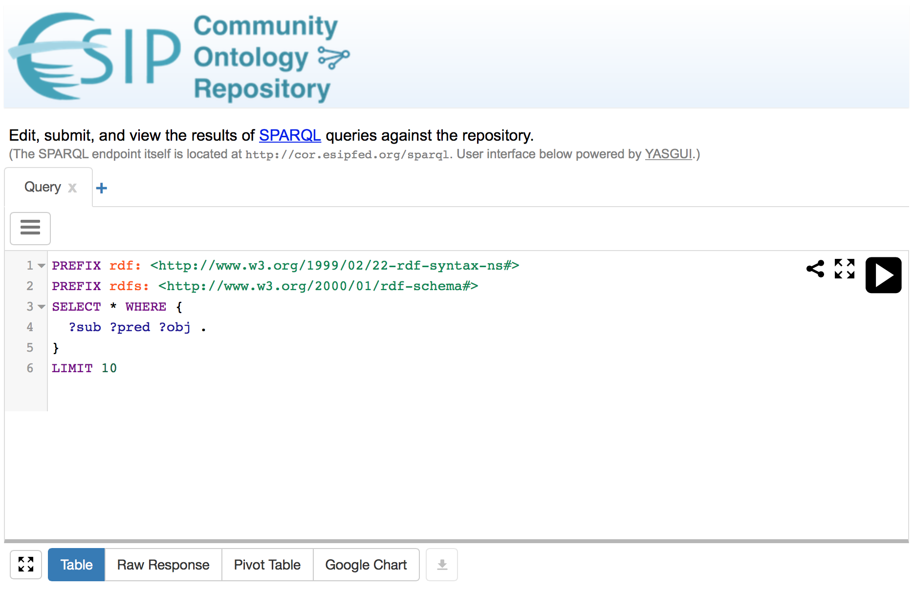

The ORR has separate SPARQL and repository APIs, but the SPARQL API provides more powerful ways to search ORR's semantic content. 
This section describes SPARQL and how to use it to perform such queries.

SPARQL is the query language for the Resource Description Framework. (The acronym is recursive: SPARQL Protocol And RDF Query Language). 
It is analogous to SQL for relational databases, allowing queries to be placed for semantic resources. 
The [Wikipedia entry for SPARQL](http://en.wikipedia.org/wiki/SPARQL) contains good background information, 
and the [W3C documentation](http://www.w3.org/TR/sparql11-overview/) provides a good technical read.

SPARQL queries can be done programmatically, with a RESTful interface using HTTP GET requests, 
against the ORR SPARQL endpoint at `http://[domain]/sparql` 
(COR example: `http://cor.esipfed.org/sparql`). 
Note that this endpoint is intended for programmatic access; not a user interface.
A web page with a user interface is available at `http://[domain]/ont/sparql` 
(COR example: [http://cor.esipfed.org/ont/sparql/](http://cor.esipfed.org/ont/sparql/), as shown below).

A number of interesting domain-specific examples can be found at 
[https://marinemetadata.org/community/teams/vocdev/orrioos](https://marinemetadata.org/community/teams/vocdev/orrioos).  

The [Querying Linked Data with SPARQL](http://www.slideshare.net/olafhartig/querying-linked-data-with-sparql) 
video provides additional information about querying with SPARQL.
