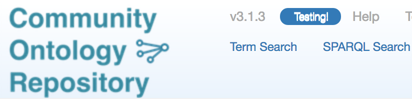

!!! tip
    Content status: **Current**

## Finding ontologies

To search the repository attributes for a given string, click on the "Term Search" link near the top center of the 
Browse page.

In the resulting search page, you can mouse over the search field for additional tips.

To find an ontology based on its name, simply enter a name fragment in the search box on the front (Browse ontologies) page. 
Enter multiple fragments (separated by spaces) to find an ontology containing all the fragments.

