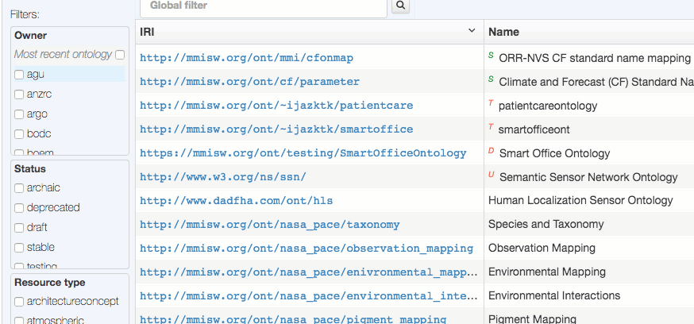

This section describes the various options to search for ontologies and terms
in the graphical user interface.

## Finding ontologies

#### Global filter

To find an ontology based on its IRI, name, author, owner, or version, enter the desired string fragments
(separated by spaces) in the search box on the front (Browse ontologies) page. 


This filtering is immediately applied as you enter the string in the input field.
You can optionally press Enter to capture the search string in the ORR URL. 
For example, after typing `sensor network` and pressing Enter in the inout fiels,
the URL for the MMI ORR becomes
[`https://mmisw.org/ont/#/so/sensor%20network`](https://mmisw.org/ont/#/so/sensor%20network).
Opening this link in a new browser window will automatically trigger the corresponding filtering.

#### Facets

You can also apply ontology filtering by using the facets on the left hand-side panel in the main page.
These facets include Owner, Status, Ontology type, and Hosting mode.  



In the Owner section you can check the special 'Most recent ontology' checkbox to only display the latest 
ontology submission per owner (organization or user).  
 
## Finding terms

To search for terms in the underlying semantic store, click on the "Term Search" link at the top of the main page browse.
Enter your search string and press Enter to execute the search.
Hovering your mouse on the `SPARQL` label next to the input field will show the SPARQL query corresponding to the search.
In the example below, the search string is `sea water salinity` with the corresponding SPARQL query being:

```
select distinct ?subject ?predicate ?object
where {
 ?subject ?predicate ?object.
 filter (regex(str(?subject), "sea water salinity[^/#]*$", "i")
   || regex(str(?object), "sea water salinity", "i"))
}
order by ?subject
```

and URL for the MMI ORR becoming 
[`https://mmisw.org/ont/#/st/sea%20water%20salinity`](https://mmisw.org/ont/#/st/sea%20water%20salinity).

To separate alternative strings for the term search, use the vertical line character `|`.


