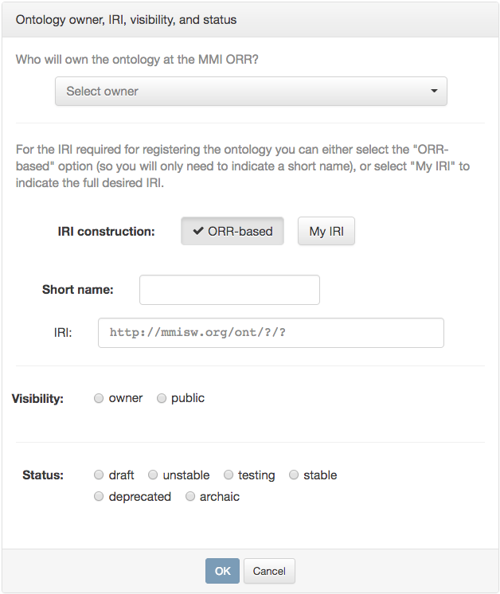
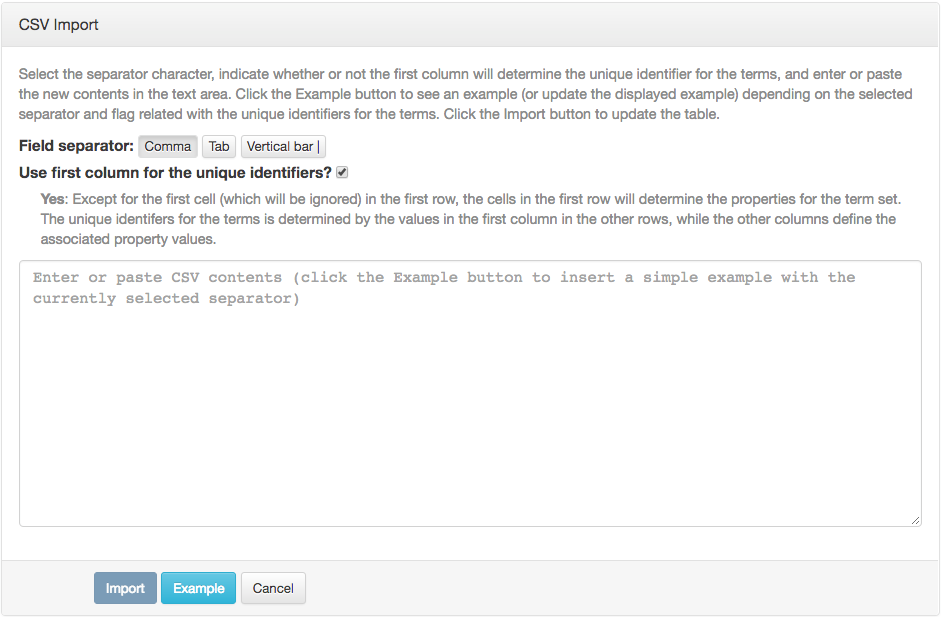

If you have your vocabulary in a delimited text file 
(typically called comma-separated- or tab-separated-values file, and commonly generated
from spreadsheet applications), 
then you may follow these steps to put it into the ORR. 

!!! note
    Direct upload of a delimited text file is not supported.
    The steps below basically consist in using the "Create Vocabulary" option
    and pasting the delimited text into a dialog box.

Once signed in, click the "Create Vocabulary" button in the main ORR page. 

Enter the owner of the vocabulary (yourself, or a group that you are a member of), 
the short name of the vocabulary that will appear in the identifier for the vocabulary,
and the desired visibility and status. 

!!! note 
    You can alternatively enter your own IRI for the vocabulary if you are an advanced user 
    (for example, you want the IRI to be in your own domain), but this is an unusual use case.

&nbsp;

Complete the metadata in the "Metadata details" section. 
Starred items are required, and pop-up help describes all the metadata items when you mouse over the item's name. 
Note there are several tabs in this section, though only a few fields on the first tab must be completed.

In the "Data" section, click on the *+Term set* button. 
You will be prompted for the name of your first set of terms in this vocabulary. 
Usually this will be the same as the local name of the ontology -- `vocabtypes` in the example -- but in camel case (vocabTypes). 

When you click OK, a tab will be created for this vocabulary. 

To import your vocabulary, click on the drop-down arrow and choose the option "Import CSV contents". 

&nbsp;

This produces the dialog box below.

 

Click the Example button to see an example (or update any previously displayed example) depending on
the selected separator and flag related with the unique identifiers for the terms.
(Trailing spaces in cells are added for clarity in the CSV text examples.)

**- Field separator** 

Indicate the field separator used in the contents inserted in the text area. 

**- Use first column for the unique identifiers?** flag

- If this flag is selected: 
Except for the first cell (which will be ignored) in the first row, the cells in the first row
will determine the properties for the term set.
The unique identifiers for the terms are determined by the values in the first column in the other rows,
while the other columns define the associated property values.

    The CSV example in this case looks like the following:
    
               ,color   ,skos:definition  ,http://ex/someprop
        info   ,blue    ,info message     ,abc
        warn   ,yellow  ,warning message  ,some xy
        error  ,red     ,error message    ,value z

- If this flag is unselected: 
In this case, all cells in the first row will determine the properties for the term set.
The unique identifiers for the terms will be determined by a given prefix (by default, `row_`)
and the row position.
All columns in the rows after the header define the associated property values.

    The CSV example in this case looks like this:
                
        co2  ,latitude    ,longitude    ,altitude  ,airSpeed
        485  ,44.3799982  ,-73.2581033  ,59.28     ,0.119999997318
        485  ,44.3799978  ,-73.2581035  ,59.28     ,0.0399999991059
        486  ,44.3799953  ,-73.2581065  ,59.25     ,0.0399999991059
        500  ,44.3805034  ,-73.258855   ,48.65     ,0.0799999982119                

Follow the instructions in the dialog box, and click on Import when you are ready to import your text. 
You will be prompted for a Confirmation, as you will be entirely replacing the existing set of terms. 
If you are following these instructions, so far there are no existing terms to replace. 
Click on OK to create the vocabulary data in preliminary form.

You can now review, further edit, and register your vocabulary. 
Please see the [“Completing Vocabulary Registration"](register.md) page for more details.
