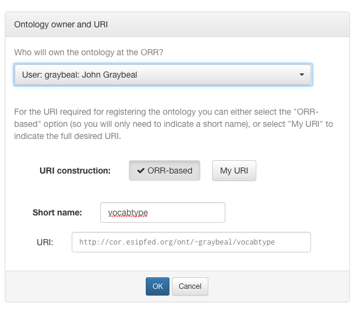
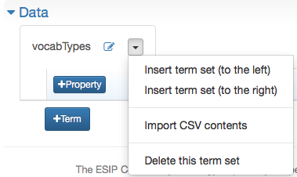

!!! tip
    _Page Status_: **Current**

If you have your vocabulary in a delimited text file, then you may follow these steps to put it into the ORR. 

!!! tip
    While direct upload of a vocabulary file is not yet supported, you may paste its text into a dialog box.

Once signed in, click "Upload vocabulary" button in the main ORR page. 

Enter the owner of the vocabulary (yourself, or a group that you are a member of), 
and the short name of the vocabulary that will appear in the identifier for the vocabulary. 
You can enter your own IRI for the vocabulary if you are an advanced user and want the IRI to be in your own domain, 
but this is an unusual use case.

&nbsp;

Complete the metadata in the "Metadata details" section. 
Starred items are required, and pop-up help describes all the metadata items when you mouse over the item's name. 
Note there are several tabs in this section, though only a few fields on the first tab must be completed.

In the "Data" section, click on the *+Term set* button. 
You will be prompted for the name of your first set of terms in this vocabulary. 
Usually this will be the same as the local name of the ontology -- vocabtypes in the example -- but in camel case (vocabTypes). 

When you click OK, a tab will be created for this vocabulary. 

To import your vocabulary, click on the drop-down arrow and choose the option "Import CSV contents". 

This produces the following dialog box.

&nbsp;

 

Follow the instructions in the dialog box, and click on Import when you are ready to import your text. 
You will be prompted for a Confirmation, as you will be entirely replacing the existing set of terms. 
If you are following these instructions, so far there are no existing terms to replace. 
Click on OK to create the vocabulary data in preliminary form.

You can now review and register your vocabulary. 
Please see the [“Completing Vocabulary Registration"](http://mmisw.org/orrdoc/vocab/register.md) page for more details.
