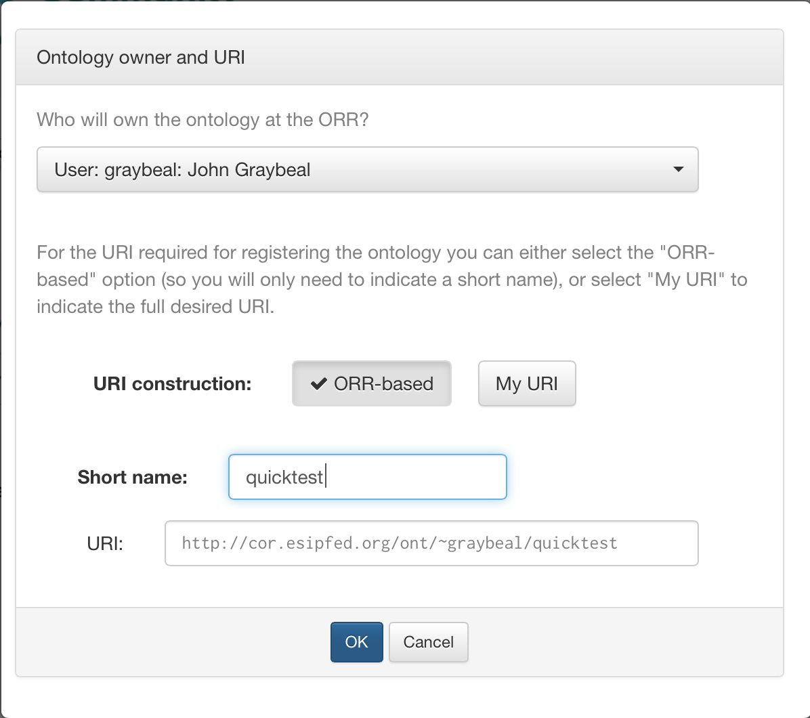
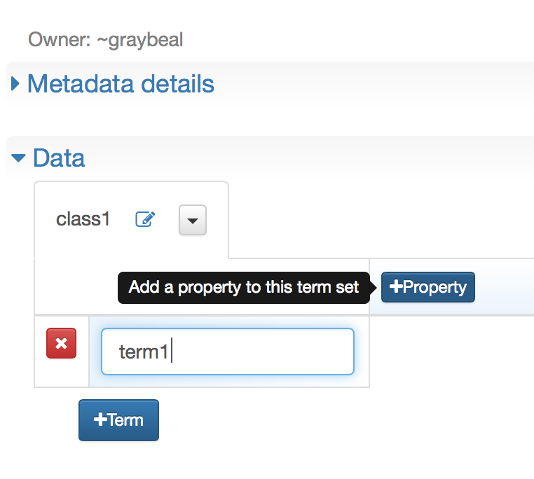

!!! tip
    _Page Status_: **In Progress**

Using the mechanism described in the [Semantic Web Basics section](/semweb/#another-triple-table-arrangement),
the ORR system includes a tool for ontology creation based on the editing of a table of definitions
in a spreadsheet-like fashion.

For example:


The first row specifies the properties (predicates) for the terms in the subsequent rows.
The first column determines the IRIs for the subjects.
The cells determine the values for the corresponding subjects and predicates.
For the example above, this basically results in the following set of
_subject-predicate-object triples_:

```
(x, p1, A)

(x, p2, B)

(x, p3, C)

(y, p1, D)

(y, p2, E)

(w, p3, K)
```

Besides metadata for the registration of the ontology entry in the repository,
the ORR also captures a _class_ for the terms defined in the table.
Specifically, the subjects (i.e., first column in the table) will be _instances_
of the given class.
 
A given _class_ and corresponding set of term instances are called a _term set_ 
in the ORR. Multiple such term sets can be defined for a single ontology entry.

The table can be populated by importing text in CSV format, 
as described in the [Vocabulary Import](/vocab/import) page. 
However, this document describes the operation of populating this table manually. 



Once signed in, click the "Create vocabulary" button in the main ORR page.

<p class="clearfix">&nbsp;</p>

To register your vocabulary, you need to create metadata to describe the ontology. Required metadata is shown with a red asterisk.


If you are not sure what a particular metadata field means, hover over the field to get help.


Start by determining the IRI for the class, either by entering a _local_ name, or
a full IRI.



Then you can fill in the vocabulary contents. 
That includes the list of terms; and the associated properties, or information, for each term. 
Click on `+Term` to add a new term, and `+Property` to add a new piece of information that needs to be filled in for each term.

<p class="clearfix">&nbsp;</p>

The example at tue beginning of this section looks like this as captured in the ORR frontend:


Once you finish entering properties, terms, and content to your satisfaction, you can review and register your vocabulary. 
Please see the [“Completing Vocabulary Registration"](/vocab/register) page for more details.
